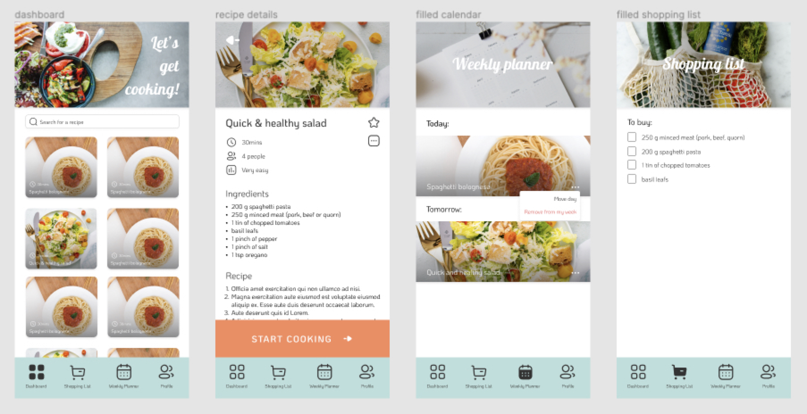

#  Student Cookbook

🚀 hosted at: https://cookbook-53824.web.app/
#

### ✨ About

A collection of quick and easy recipes with shopping list, weekly planner and a step by step guide.

Simply log inusing email and password or your Google account and browse thorugh the recipes. Once you choose something delicious, add the recipe to your weekly planner and ingredients to the shopping list.

No more <B>'what should I cook today?'</b> or <b>'oh no, I don't have all the ingredients!'</b> With student cookbook you know what to cook everyday and grocery shopping is a breeze with all ingredients you need in one shopping list! Bon apetit! 
🍔 🌮 🥗 🍲 🧁
#

### 🛠 Technologies used: 
- React
- Tailwind CSS
- Firebase with FireStore

Also using: 
- [react-router-dom](https://reactrouter.com/)
- [react-notifications](https://www.npmjs.com/package/react-notifications)
- [react-calendar](https://www.npmjs.com/package/react-calendar)
- [luxon](https://moment.github.io/luxon/#/)
- [yup](https://github.com/jquense/yup)
- [underscore](http://underscorejs.org/)

#

### If you would like to run the project locally:

```npm install``` to install all dependencies

```npm run start``` to run the server and watch for changes

#

⚠️ 
While this app is fully functional and stable, it's still very much an MVP (minimal viable product) More features and improvements may be added in the future.

#

