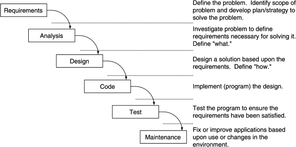
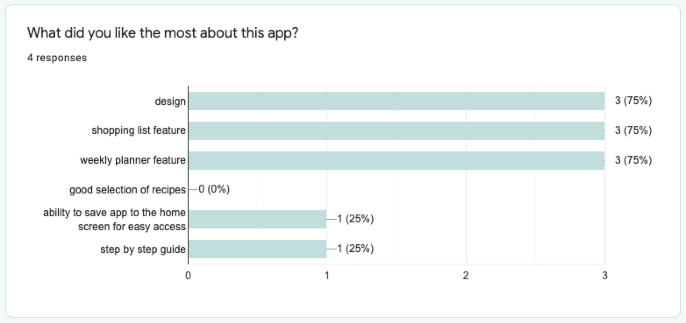
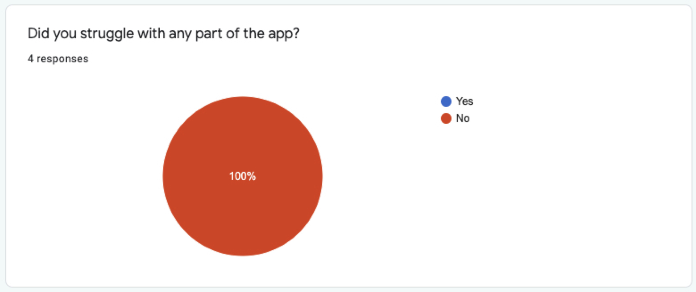
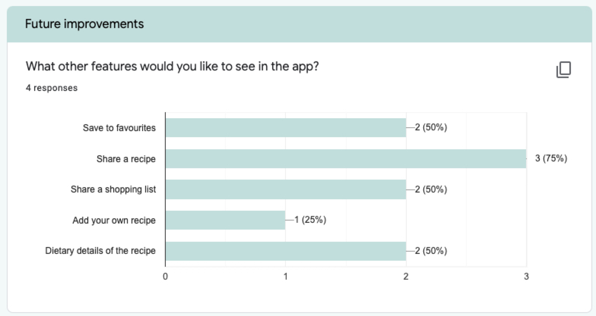

#  Student Cookbook

Author: Katarzyna Wlodarczyk

Hosted at: [https://cookbook-53824.web.app/](https://cookbook-53824.web.app/)

GitHub repository: [https://github.com/katwlodarczyk/student-cookbook](https://github.com/katwlodarczyk/student-cookbook)

#

## Introduction

Student Cookbook aims at aiding students and young adults at improving their diet and cooking skills. 

A progressive web app created in React follows the standards of modern applications and uses professional tools and techniques. As the app is intended to be used while preparing meals, the project has been created purely for mobile phone usage, and should be used on those devices only. While it’s possible to use the app on bigger screens, due to time constraints, styling of the user interfaces for bigger screens have not been prioritized. Evaluation of results from talk-out-loud sessions with a small group of representative user base has been very positive. A collection of fast and easy recipes and step by step guide on how to prepare them might improve young people's cooking abilities and the overall enjoyment from cooking while an integrated shopping list and weekly planner should help increase the frequency of cooking. 

## Methodology

The project uses a waterfall model as development methodology.

SDLC diagram (https://www.sciencedirect.com/topics/computer-science/development-methodology)

‘Requirements’, ‘analysis’ and ‘design’ phases have been completed in a previous assignment (AE1). This assignment (AE2) focuses on ‘code’ and ‘test’ phases. Maintenance phase will be conducted in the future. Waterfall methodology has been chosen as it allows to keep the project within a strict time frame and gives the best chance of meeting the deadline.   

### Methods

Proposed solution has been evaluated based on ‘talk-out-loud’ sessions with 4 representative users that fit the description of a target user defined in the requirements phase. ‘Talk-out-loud’ sessions allowed to understand how users might use the app, discover any ‘pain-points’ and potential gaps in the project. Although more time consuming in contrast to other methods, like for example online surveys/ questionnaires alone, those might not provide such in-depth results and understanding of potential users. The amount of sessions have been restrained by a short timeframe, however more sessions might be conducted in the future if the project is to be improved upon.

The sessions were approximately 15 minutes and consisted of 2 parts. The first part was to observe the participant interact with the app, how they move about through the screens and if they struggle with any part of the application. Afterwards, participants were given an online questionnaire to fill out. The survey contains seven questions about their interaction with the app, whether or not they would like to use it in the future and if they think it could solve the issue of poor diet and cooking skills among students and young adults.

Because of the limited time frame, it was not possible to conduct a longer study of the likelihood of the app solving the issue stated above, therefore conclusions will be based on the opinion of the representatives of potential users.

## Conclusion / Results

The results from the conducted sessions with potential users are promising. Both the observation and questionnaire parts strengthen the belief in this idea and its ability to solve the issue of poor diet and cooking skills of young adults. 

All participants were able to register or use federated login via their personal google accounts to access the app, they have been able to browse through the collection of recipes, go to a single recipe page, add it to their shopping lists and weekly planner. They could easily change the screens via the tab bar at the bottom, in order to access different parts of the app. If they haven’t done so already, participants were asked, without any instructions on how to do it, to cross out some items from their shopping list and afterwards to clear the list from all the items, like also to move some recipes to a different date and remove some other recipes from the planner. All participants were able to complete those tasks without any problems, which is a good indication of the correct flow and use of technologies and design that is familiar to its users. As Pickering (2016) states, “_by making things that behave in a certain way appear as expected, we help our users make the most of their cognitive cache. In other words, we don’t make them think._” 

A survey that took place after the initial observation part of the talk-out-loud sessions helped to quantify the opinions of the testers of the app and to visualise the results on the graphs.

The first question revealed the need to improve the selection of the recipes, but confirmed the demand for the other two main features (shopping list and weekly planner), which most respondents liked the most.   

The next question was about any “pain points” that users may encounter while interacting with the application. Those may be for example actions that did not give users any feedback or unclear behaviour of the app. Looking at the graph below it is clear that none of the participants struggled with any part of the app. This may be because young people are proficient in using technology and using various apps is a part of their everyday life.  Taking into consideration that this app’s main target audience are students and young users, there is no need for further study on this concern.

The next section was intended to find any features that users might be missing from the app. Most people would like to be able to share a recipe, which initially was a part of the development, as well as a save to favourites button, however due to the limited time, other functionalities have been prioritized. Those features will most likely be added to the application if any further development will take place in the future.   

The final two questions asked if participants would use this app in the future and if they think it could help its users cook more often and have a more varied diet. Here, the answers have been very positive, with all participants wanting to use the app in the future and stating that the app might solve the issue of poor diet and cooking skills among young adults. 

Based on the results from the conducted studies from the analysis phase (included in AE1) it is clear that there is a need for the application that would help students take care of their nutrition and improve their planning and cooking skills. Proposed ‘Student Cookbook’ app seems to be a good solution for that need. Talk-out-loud sessions have solidified the correct balance of functionality with a user interface style. The app's minimal design and focus on the main features of the app makes it usable and accessible by most of the people with a smartphone or internet access. 

The ability to add the app to the user’s home screen on their phone makes it even easier to use, as there is no need to open the browser and type in the address. Being a progressive web app also gives users a little bit more screen space (no address bar and other browser-related UI), which, having in mind limited dimensions of a mobile phone screen, makes a huge difference. 

The application at the current state should be considered as an MVP (Minimal Viable Product). While fully functional and usable, there are a lot of improvements that could be implemented in the future that would enhance user experience. Apart from adding more features (like save to favourites button or share a recipe mentioned above), loading screens, quite simple and ‘spartan’ at the moment, could be changed into skeleton screens with animated spinners. Another upgrade worth executing would be an ‘Add to home screen’ notification could also be added to inform the user about the ability to use it as if it was a native app, since some people might not realise that. In order to promote the application and influence change in as many people as possible, a promotional page or website should also be developed, where users can find out more information about the app and download it to their home screens.

In conclusion, based on results from the conducted study, a Student Cookbook app has a good chance to be a solution solving a problem of a poor diet and cooking skills of students and young adults.

## References

PICKERING, H., 2016. _Inclusive design patterns_. Freiburg, Germany: Smashing Magazine p.130